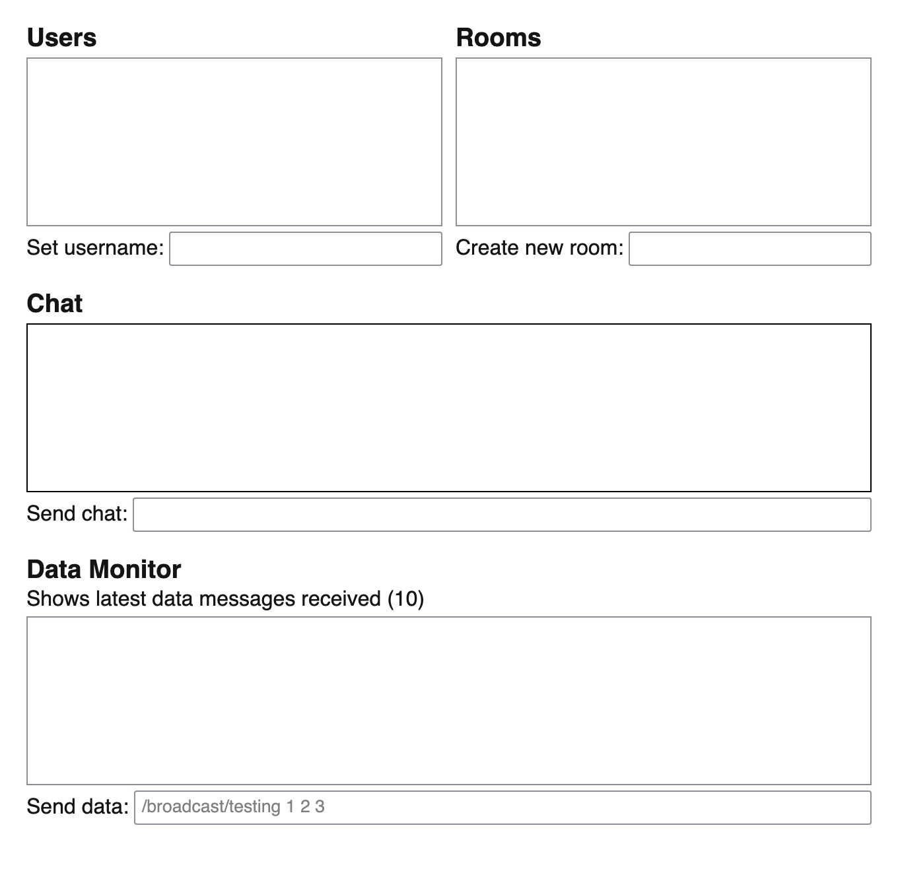

# CH Refresh Prototype

This project is a prototype for a refresh concept of the [Collab Hub](https://www.collab-hub.io) networking tool for live multimedia performers. Whereas the current version of Collab Hub uses individual client applications for different platforms (e.g., Max, Pure Data, Processing), this new prototype aims to consolidate them into a single web-based interface.

Additionally, the messaging [protocol](#protocol) has been revised to adhere to familiar [OSC](https://ccrma.stanford.edu/groups/osc/index.html) address patterns.

Both Collab Hub and this prototype aim to remove barriers for both local and remote network collaboration, regardless of physical location or the type of network used (e.g., cellular data, school or business Wi-Fi, etc.). Under the hood, messages are sent using WebSockets over the internet, which, unlike OSC, are typically not blocked by institutional network admins and do not require any additional configuration.



## Versions

Although the interface and messaging protocol are identical for all versions, there are still three different ways to use this prototype.

Common to all versions are:

- **Users** - Users are automatically assigned a long and hard-to-read ID when first connected. You can change this at any time using the corresponding input. Usernames do not require any account setup and are given out on a "first come, first served" basis. They are simply intended as a quick way to identify each other. The checkboxes next to each username in the **Users** window control whose feeds you are subscribed to (see [protocol](#protocol) below for more details).
- **Rooms** - Rooms are how users get assigned to optional groups. Any existing rooms will be listed in the **Rooms** window. The checkboxes next to each room name manage which rooms you are in. If you are the last person to leave a room, it will automatically be deleted. You can also "force delete" a room and kick everyone out by clicking the X button next to a room name. To create a new room, enter a room name in the corresponding input (you will also automatically join that room).
- **Chat** - A simple chat message window is provided for basic communication between all users.
- **Data** - Sending and receiving control data is at the heart of Collab Hub. You can read more about how data is managed and routed in the [protocol](#protocol) section below. A simple text input is provided to manually enter data to send to others, but this is a very cumbersome method and is only intended for testing or the occasional "one off" message.
- **Controls** - Controls will only be visible if you provide parameters to configure them on launch. This will be discussed more in the individual method sections below.

### Web

Simply load [https://ch.ersheff.com](https://ch.ersheff.com) in any web browser, desktop or mobile. While you cannot do much with incoming data (except for monitoring recent data), the web version still provides most or all of the user, room, chat, data, and control functionality.

#### Parameters

You can set an initial configuration by modifying query parameters in the URL.

- `username` - Start with your desired username right away without needing to change it after connecting. If the username is not available, you will be assigned a randomly generated ID like usual.
- `rooms` - Create or join one or more rooms immediately upon connection. Separate multiple room names with commas.
- `buttons`, `sliders`, `toggles` - Display any number of these control types at the bottom of the window.

Example:
`https://ch.ersheff.com?username=fred&rooms=parlor,misfits&buttons=2&sliders=2&toggles=4`

### Max

For [Max](https://cycling74.com), this prototype takes advantage of the native `jweb` object that loads a web page inside of your patch. All of the same functionality and configuration options described in the [Web](#web) section above also apply to the Max version, but you will most likely want to use the built-in control objects (dials, sliders, etc.) to send data to other users (instead of creating them inside the `jweb` window's web interface).

Outgoing data is sent to the left input of `jweb`, and incoming data is received at the left outlet.

Download `test.maxpat` and open it in Max to see more.

### Standalone App - CH Bridge

**CH Bridge** is a standalone app that sends and receives OSC from any other OSC-enabled software on your computer (using ports `9990` and `9991` by default, respectively) and mirrors that data to the server. Again, all of the same functionality and configuration options described in the sections above are available with **CH Bridge**, though configuration is set using the "Open Config" option in the menu instead of URL query parameters.

```
# CH Bridge Configuration - changes take effect on reload

# OSC ports
send=9990
receive=9991

# Server and UI
address=https://ch.ersheff.com
username=
rooms=
buttons=0
sliders=0
toggles=0
```

You can change the OSC `send` and `receive` ports if you wish, as long as they are matched in your other application. Also, as with the Max version, you will likely want to use the native controls of whatever application you are using to send outgoing data, but basic `buttons`, `sliders`, and `toggles` are still available if you need them.

You should NOT change the address unless you are running your own CH Refresh Prototype server, which is not supported at this time (though the procedure may be documented in the future if this prototype goes to production).

To use **CH Bridge**, download the appropriate version from [Releases](https://github.com/ersheff/CH-Refresh-Prototype/releases) and open the app alongside any OSC-enabled software. An example using [Pure Data](https://puredata.info), which is free, is provided in this repository. Download `test.pd` and open it in Pure Data to see more.

_Until this goes into production, **Mac** users will need to remove **CH Bridge** from quarantine after downloading in order to open the app. To do so, run the following command in Terminal:_

```
xattr -cr ~/Downloads/CH\ Bridge.app
```

_**CH Bridge** is also available for **Windows** and **Linux** but has not yet been tested on those platforms._

## Protocol

For consistency across versions, all messages must include valid OSC addresses. The address format determines how a message is interpreted and routed by the server.

### Outgoing

There are four types of outgoing messages, determined by the first segment of the OSC address:

- `/broadcast` - Broadcasts to all connected clients.
- `/feed` - Sent only to clients subscribed to the sending user's feed.
- `/room/roomname` - Broadcasts to all clients in the specified room.
- `/user/username` - Sent directly to the specified user.

Any number of additional path segments may optionally follow for more detailed routing on the receiving end.

Examples:

- `/broadcast/volume 0.9`
- `/feed/sample piano.wav`
- `/room/melody/synth/cutoff 500`
- `/user/eric 1 2 3`

### Incoming

Incoming messages include an OSC address that identifies the origin:

- `/broadcast/username`
- `/feed/username`
- `/room/roomname/username`
- `/user/username`

On the receiving end, `username` corresponds with the sender's username (it is added or replaced by the server as needed). These addresses may also be followed by additional path segments.

## Users

To subscribe or unsubscribe from a user's feed, click the toggle next to their username.

## Rooms

To join or leave a room, click the toggle next to the room name. You do not need to be in a room to send data to it. Empty rooms are deleted automatically when the last user leaves. You can "force delete" a room by clicking the button next to its name.
